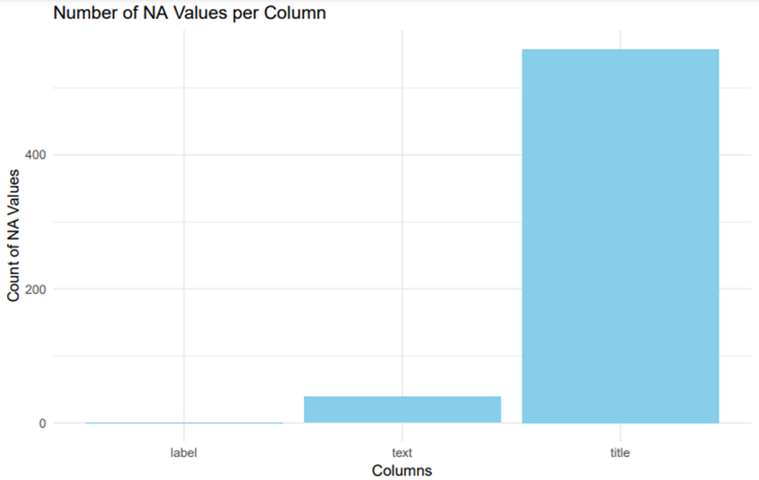
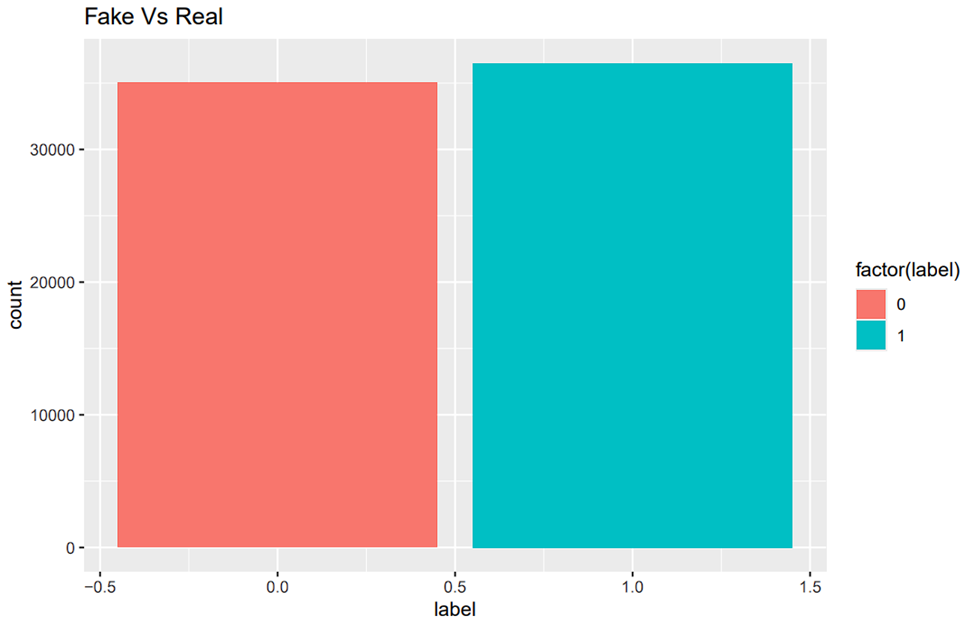
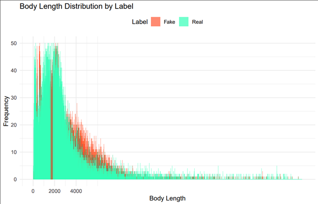
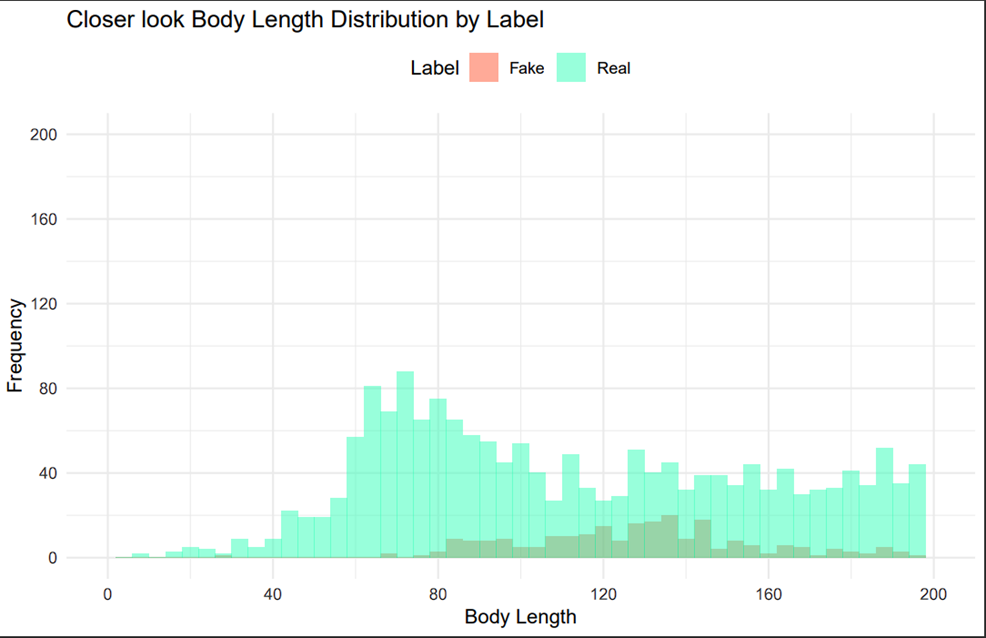
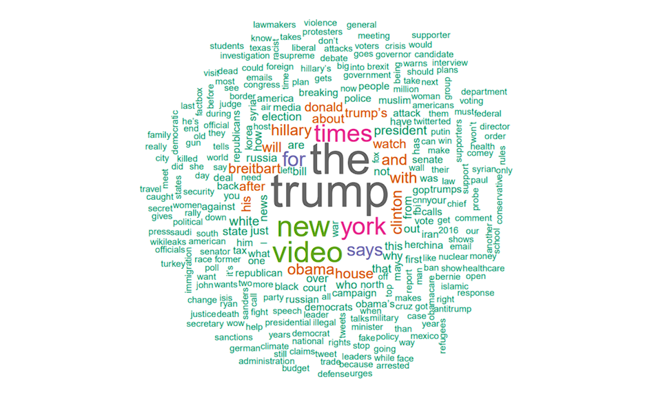
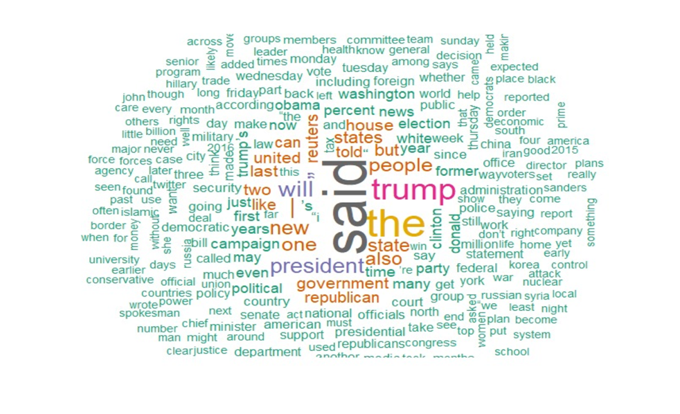
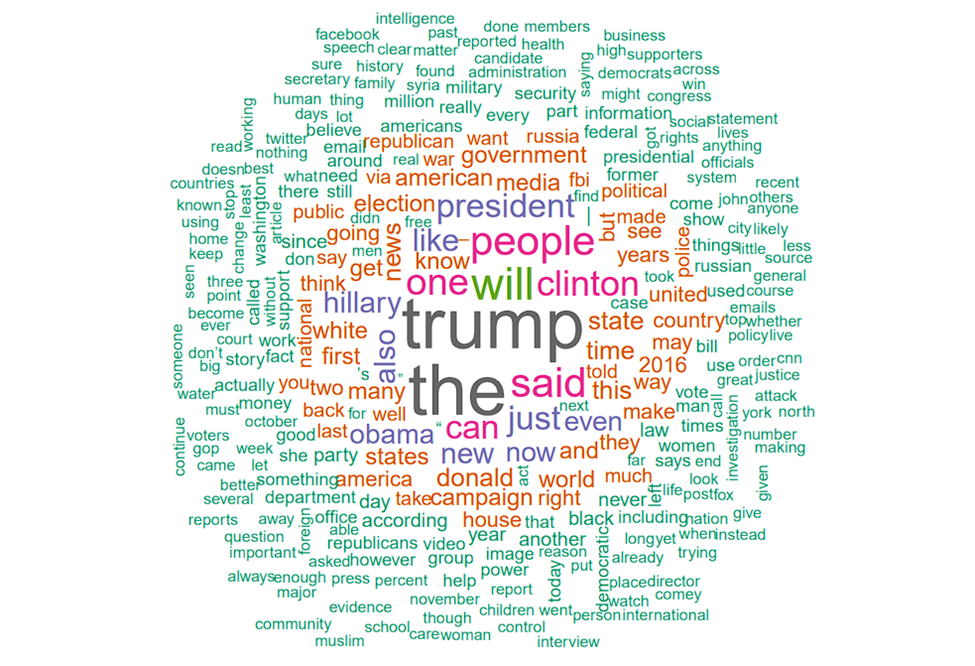
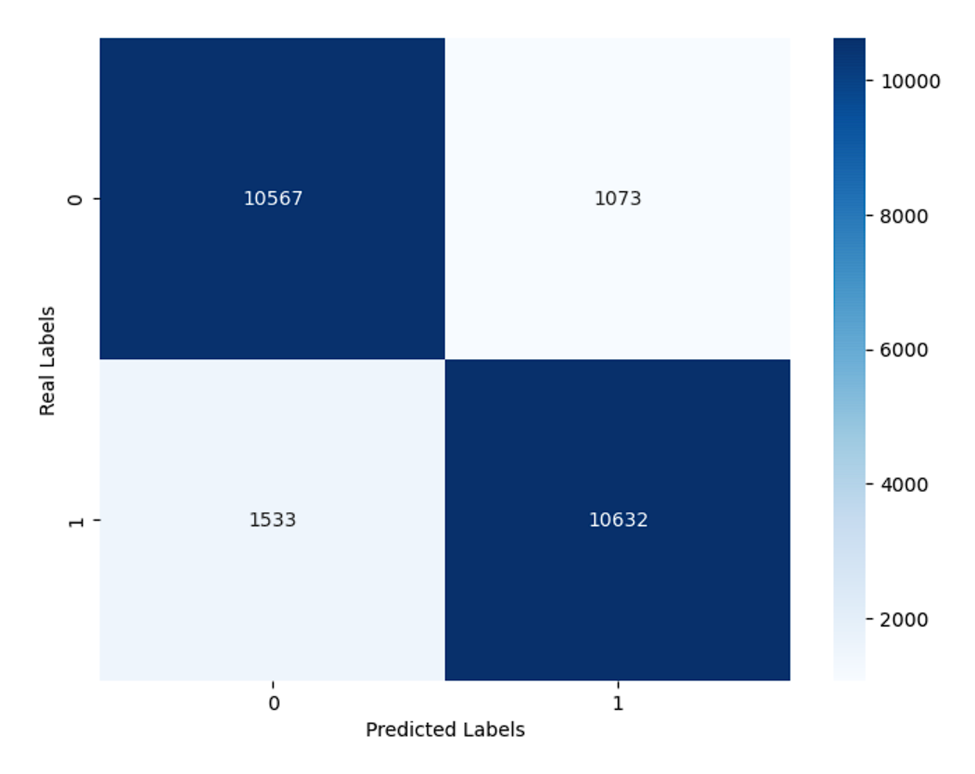
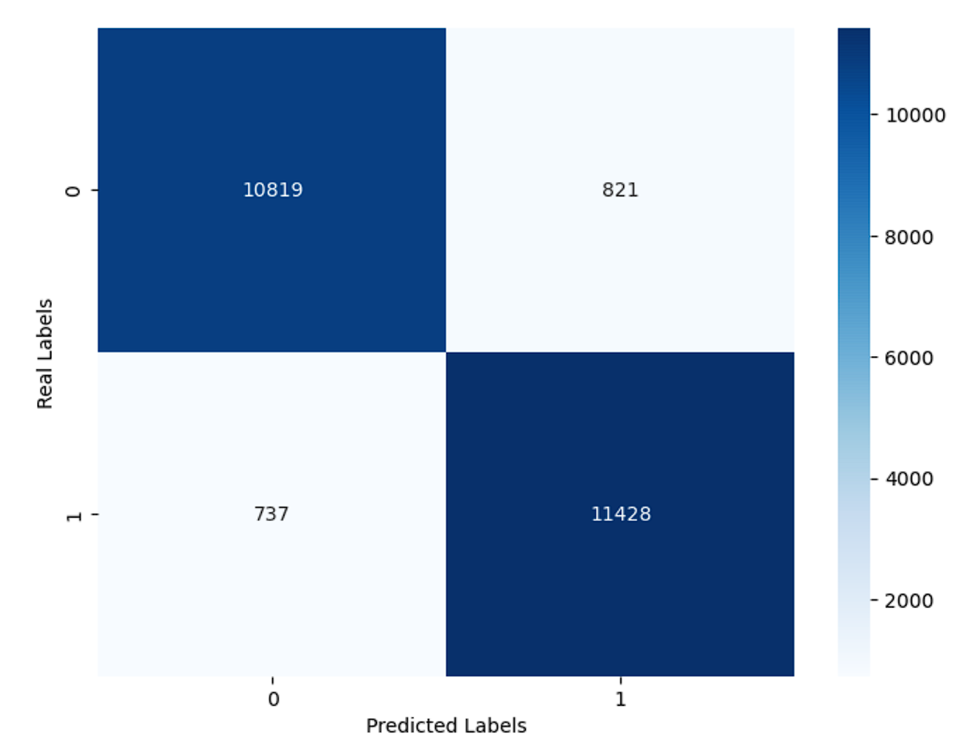

# 📰 Fake News Detection Using Machine Learning (R)

A machine learning pipeline in R to classify news articles as **fake or real** using the [WELFake Dataset](https://zenodo.org/records/4561253). Covers end-to-end steps: data cleaning, EDA, text preprocessing, and training two classifiers — Naive Bayes and Random Forest.

---

## 📁 Project Structure

```
fake-news-detection/
├── fake_news_detection.R       # Main analysis and modelling script
├── WELFake_Dataset.csv         # Dataset (download separately — see below)
├── results/
│   ├── missing_values.png
│   ├── label_distribution.png
│   ├── body_length_full.png
│   ├── body_length_zoom.png
│   ├── wordcloud_titles.png
│   ├── wordcloud_fake.png
│   ├── wordcloud_real.png
│   ├── nb_confusion_matrix.png
│   ├── rf_confusion_matrix.png
│   └── model_comparison.png
└── README.md
```

---

## 📊 Dataset

**WELFake** contains ~72,000 news articles from multiple online platforms, labelled as:
- `1` → Fake
- `0` → Real

| Field   | Description               |
|---------|---------------------------|
| `id`    | Unique article identifier |
| `title` | Headline of the article   |
| `text`  | Full body content         |
| `label` | Target — 1: Fake, 0: Real |

The dataset is nearly balanced — **51.44% Real / 48.55% Fake** — so no resampling was needed.

> Download from: https://zenodo.org/records/4561253  
> Place `WELFake_Dataset.csv` in the project root before running.

---

## ⚙️ Requirements

```r
install.packages(c(
  "ggplot2", "dplyr", "tidyverse", "stringr", "caTools",
  "tm", "wordcloud", "RColorBrewer", "text2vec", "Matrix",
  "e1071", "caret", "randomForest"
))
```

---

## 🚀 How to Run

```r
source("fake_news_detection.R")
```

> Recommended to use `source()` rather than copy-pasting into the console to avoid encoding issues.

---

## 🔍 Pipeline Overview

| Step | Description |
|------|-------------|
| **Data Cleaning** | Drop unnamed index column; remove 558 rows with empty titles and 39 with empty text |
| **EDA** | Label distribution bar chart, body length histograms, missing value plot |
| **Feature Engineering** | Combined `title + text` field; character length feature (excluding spaces) |
| **Word Clouds** | Top words across all titles, fake news body, and real news body |
| **Preprocessing** | Lowercase → remove punctuation/numbers/stopwords (SMART) → strip whitespace |
| **Bag-of-Words** | `DocumentTermMatrix` with 90% sparsity filter; test DTM aligned to training vocabulary |
| **Naive Bayes** | Probabilistic baseline (`e1071`) |
| **Random Forest** | Ensemble classifier (`ntree = 300`) |
| **Evaluation** | Confusion matrix, Accuracy, Precision, Recall, F1 |

---

## 📉 Data Cleaning

### Missing Values per Column


558 rows had empty titles and 39 had empty body text — all were dropped. The `label` column had no missing values.

---

## 📊 Exploratory Data Analysis

### Label Distribution


Near-perfect balance between fake and real articles (51.44% vs 48.55%), which means accuracy is a reliable primary metric.

### Body Length Distribution


Real news articles are systematically longer than fake ones. The zoomed view below makes this clearer at the lower end of the scale.



Very short articles (under 200 characters) are almost exclusively fake.

---

## ☁️ Word Clouds

### All Titles


Election and presidential content dominates — Trump, Clinton, President, and election-related terms appear most frequently across both classes.

### Fake News


### Real News


Fake news vocabulary tends to be more emotive and sensationalist, while real news features more formal, entity-rich language.

---

## 📈 Results

| Model         | Accuracy |
|---------------|----------|
| Naive Bayes   | 73%      |
| Random Forest | 93%      |


### Naive Bayes — Confusion Matrix


### Random Forest — Confusion Matrix


Random Forest outperforms Naive Bayes by ~20 percentage points. The independence assumption in Naive Bayes limits its ability to capture word co-occurrence patterns that carry meaningful signal in fake news text.

---

## 💡 Key Findings

- **Real news is longer** — body length is a meaningful signal; fake articles cluster at shorter lengths.
- **Political content dominates** — the dataset is heavily skewed toward US political news across both classes.
- **Random Forest wins by a large margin** — 93% vs 73%, with consistent precision and recall across both classes.

---

## 🛠 Key Design Decisions

- **Sparsity filter at 90%** — retains only the most frequent terms, significantly reducing dimensionality.
- **Vocabulary alignment** — test DTM is aligned to training vocabulary to prevent data leakage.
- **Column sanitisation** — column names are cleaned before Random Forest training to avoid formula parsing errors.
- **80/20 stratified split** — `sample.split` preserves the label ratio across train and test sets (`set.seed(53)`).

---

## 🙋 Author

> Zaheer Hussain
---

## 📄 License

[MIT License](LICENSE.txt)